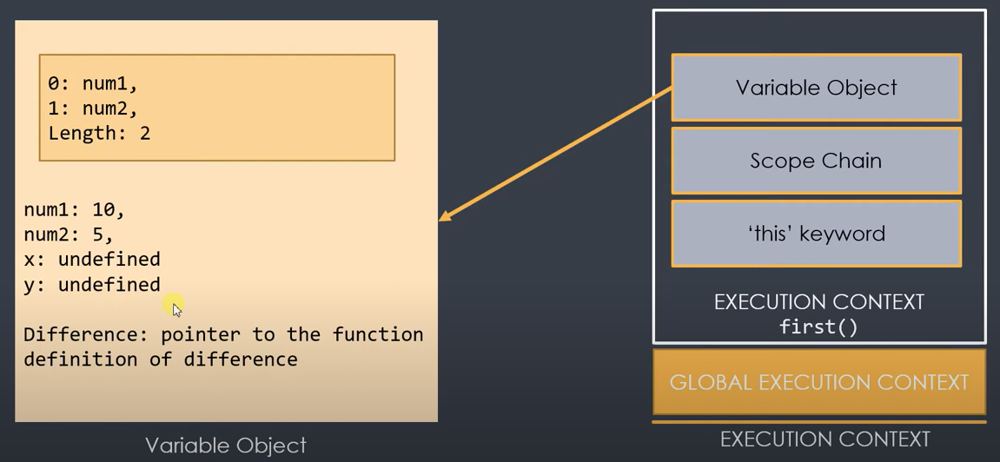
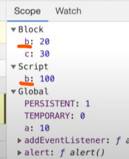
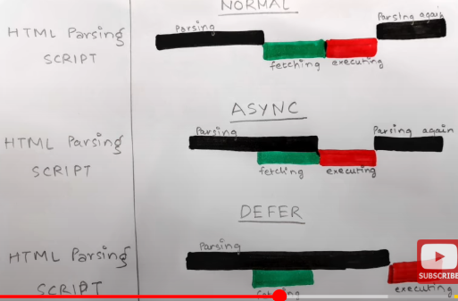

# JAVASCRIPT INTERVIEW QUESTIONS 
### Table of Contents

| No. | Questions |
| --- | --------- |
| 1 | [ JavaScript Engine ](#1-what-is-a-javascript-engine) |
| 2 | [ Working of Javascript Engine ](#2-how-does-a-javascript-engine-work) |
| 3 | [ Execution Context ](#3-what-is-execution-context-) |
| 4 | [ Hoisting ](#4-hoisting) |
| 5 | [ Scope Chain ](#5-what-is-scope-chain-) |
| 6 | [ this keyword ](#6-what-is-the-this-keyword-in-javascript) |
| 7 | [ How to iterate over a JavaScript object ? ](#7-how-to-iterate-over-a-javascript-object-) |
| 8 | [ Is Javascript Synchronous or Asynchronous ? ](#8-is-javascript-synchronous-or-asynchronous-) |
| 9 | [ What is Strict mode in javascript? ](#9-what-is-strict-mode-in-javascript) |
| 10 | [](#) |
| 11 | [](#) |
| 12 | [](#) |
| 13 | [](#) |
| 14 | [](#) |
| 15 | [](#) |
| 16 | [](#) |
| 17 | [](#) |
| 18 | [](#) |
| 19 | [](#) |
| 20 | [](#) |
| 101 | [JavaScript Calculator](#JavaScript-Calculator) |
| 102 | [](#) |
| 103 | [](#) |
| 104 | [](#) |
| 105 | [](#) |
| 106 | [](#) |
| 107 | [](#) |
| 108 | [](#) |
| 109 | [](#) |
| 110 | [](#) |
| 111 | [](#) |
| 112 | [](#) |
| 113 | [](#) |
| 114 | [](#) |
| 115 | [](#) |
| 116 | [](#) |
| 117 | [](#) |
| 118 | [](#) |
| 119 | [](#) |
| 120 | [](#) |


**[⬆ Back to Top](#table-of-contents)**

### What is Compiler?
* A compiler is a program that translates the entire code written in a programming language (source code) into machine code or an intermediate language that a computer can execute. 
* This process happens before the program runs.
* It is more efficient than Interpreter.

Eg. C, C++, Go, Java are Compiled languages


**[⬆ Back to Top](#table-of-contents)**

### What is Interpreter?
* An interpreter is a type of program that directly executes instructions written in a programming or scripting language without needing to first compile them into machine code. 
* It processes the code line by line or statement by statement at runtime.
* It is faster than compiler. 

Eg. Python, Ruby, Javascript are Interpreted languages.


**[⬆ Back to Top](#table-of-contents)**

### Is Javascript Interpreted or Compiled language? 
* Initially when launched, Javascript was only interpreter language, because browers had to quickly use the code.
* Now most of the browsers use Interpreter + Compiler .
* It depends on JS  Engine whether the code is simply interpreted or JIT compiled.


**[⬆ Back to Top](#table-of-contents)**


### 1. What is a JavaScript Engine?
A JavaScript engine is a program or interpreter that executes JavaScript code. It is responsible for parsing, optimizing, and running the code written in JavaScript, enabling it to interact with web pages, servers, and other applications.

Modern JavaScript engines are highly optimized and use Just-In-Time (JIT) compilation to improve performance.

**Popular JavaScript Engines**
* V8 (Google)
* SpiderMonkey (Mozilla)
* JavaScriptCore (JSC or Nitro)
* Chakra (Microsoft)
* Hermes (Meta)

<div>
<p align="center">
    
</p>
</div>


**[⬆ Back to Top](#table-of-contents)**

### 2. How Does a JavaScript Engine Work?

**Parsing:**
The engine reads the JavaScript code (source code) and converts it into an abstract syntax tree (AST), a structured representation of the code.

**Compilation:**
Instead of interpreting JavaScript directly (line-by-line), modern engines use JIT compilation, where the code is compiled into machine code during execution for faster performance.

**Execution:**
The compiled machine code is executed, and the JavaScript program runs.

**Optimization:**
Engines continuously analyze the running code and optimize it for better performance, adapting to frequently executed paths (hot code).


**[⬆ Back to Top](#table-of-contents)**

### 3. What is Execution context ?
In JavaScript, the execution context is the environment in which JavaScript code is evaluated and executed. It determines:
* What data is accessible (variables, functions, objects).
* How the code behaves in a specific context.
Every time a function is invoked, or the global code is executed, an execution context is created.

<div>
<p align="center">
    
</p>
</div>


### TYPES of Execution Context
1. Global Execution Context (GEC)
2. Function Execution Context (FEC)
3. Eval Execution Context (rare)


### PHASES of Execution Context**

Each execution context goes through two phases:

**Creation Phase:**
* Creates the Variable Object - Memory is allocated for variables and functions.
* Creates the scope chain - List of all scopes.
* Variables are set to undefined (hoisting).
* Functions are stored in their entirety (hoisting).
* this is determined based on the context.

**Execution Phase:**
* Code is executed line by line.
* Variables are assigned their actual values.


<div>
<p align="center">
    
</p>
</div>

**COMPONENTS of an Execution Context**

**Variable Environment:**
1. Stores variables, function declarations, and the outer environment reference.

**Lexical Environment:**
* The structure holding the local variables and functions.
* Considers the location of variables in the source code.

**Lexical Scope** (or static scope) refers to the scope determined by the position of variables and functions in the source code. It means that a function's scope is defined during its creation, based on where it is written in the code, not where it is called.


```javascript
function a(){
    var b=10;
    c();
    function c(){

    }
}
```
Here,
* c is lexically inside a 
* a is lexically inside global scope.

**this Binding:**
1. Refers to the object associated with the execution context.
2. In the global context, this refers to the global object (window or global).
3. Inside functions, it depends on how the function is called (e.g., method call, arrow function).

**Execution Context STACK (Call Stack)**
JavaScript uses a call stack to manage execution contexts. When a function is called:

1. A new execution context is created and added to the stack.
2. When the function finishes execution, its context is removed from the stack.

**Examples**
```javascript
    var name = "Jack";                  
    console.log("Global Execution Context : Invoked & Pushed  - variable name, func greeting() sayHi()");

    function greeting() {
        console.log('Execution context greeting: Invoked & Pushed')
        console.log("GREETING");
        sayHi();
        console.log('Execution context greeting: Popped off')
    }

    function sayHi() {
        console.log('Execution context sayHi: Invoked & Pushed')
        console.log("HI " , name.toUpperCase() , 'HOW ARE YOU ? ' );
        console.log('Execution context sayHi: Popped off')
    }

    greeting();
    console.log("Global Execution Context : Popped off");

```
Execution Steps:
* STEP 1: The GEC is created and pushed on the execution stack as the global() object.
* STEP 2:  
    * The greeting() function is invoked and pushed on the stack.
    * The sayHi() function is invoked and pushed on the stack.
* STEP 3: 
    * The sayHi() function is popped off the stack.
    * The greetings() function is popped off the stack.
---
<div>
<p align="center">
    
</p>
</div>

---


Visualizing Execution Context
```javascript
    function greet() {
        let name = "John";
        console.log("Hello, " + name);
    }

    greet();
```
* Global Execution Context:
    * greet is defined.
* Function Execution Context for greet:
    * name is stored in memory.
    * console.log() executes.


**[⬆ Back to Top](#table-of-contents)**

### Hoisting
Hoisting is a JavaScript mechanism where variable and function declarations are moved to the top of their containing scope during the compilation phase, before the code is executed. This means you can use variables and functions before they are declared in the code.

However, only the declarations are hoisted, not the initializations or assignments.

1. Function declarations are fully hoisted.
2. Variable declarations with var are hoisted but initialized to undefined.
3. Variables declared with let and const are also hoisted but remain in a temporal dead zone (TDZ) until their declaration is encountered in the code.

| Declaration Type           | Hoisted?                  | Initialized?           | Temporal Dead Zone?        |
|----------------------------|---------------------------|------------------------|----------------------------|
| var                        | Yes                       | Yes (undefined)        |	No                         |
| let                        | Yes                       | No                     | Yes                        |
| const                      | Yes                       | No	                  | Yes                        |
| Function Declaration	     | Yes (entire function)	 | Yes	                  | No                         |
| Function Expression        | Only the variable         |	No                    |	No                         |


**[⬆ Back to Top](#table-of-contents)**

### Examples of Hoisting

1. Hoisting with function declarations
```javascript
    greet(); // Output: Hello, World!

    function greet() {
        console.log("Hello, World!");
    }
```
Function declarations are fully hoisted, meaning you can call the function before its declaration.

2. Hoisting with var 
```javascript
    console.log(a); // Output: undefined
    var a = 10;
    console.log(a); // Output: 10

```
During the compilation phase, the declaration var a is hoisted to the top.
The variable is initialized to undefined until the assignment a = 10 is executed.

3. Hoisting with let and const
```javascript
    console.log(b); // ReferenceError: Cannot access 'b' before initialization
    let b = 20;
```
For let & const, the area before initialization is called the temporal dead zone (TDZ).
let and const declarations are hoisted but are not initialized until their line of declaration is reached.

4. Hoisting with function expressions 
```javascript
    greet(); // TypeError: greet is not a function
    var greet = function () {
    console.log("Hello How are you ?");
};
```
Here, greet is declared with var and is hoisted as a variable(var greet). 
However, its value (the function) is not assigned until runtime (Creation phase has created it as variable greet = undefined. Execution phase cannot read function of undefined undefined()).


**[⬆ Back to Top](#table-of-contents)**

### Can you redeclare let and var?

let variables cannot be redeclared. It is strict. Below codes will give Syntax error: Identifier a has already been declared.
```javascript
    let a = 10;
    let a = 20;
```

```javascript
    let a = 10;
    var a = 20;
```

var variables can be redeclared
```javascript
    var a = 10;
    var a = 20;
```

const is even more strict. It asks to be initialized while declaration only. Below code gives syntax error: Missing initializer in const declaration.
```javascript
    const a;
    a = 20;
```

while below code gives TypeError: Assignment to constant variable not allowed.
```javascript
    const a = 10;
    a = 20;
```

below code gives Reference error: y is not defined.
```javascript
    console.log(y);
    let a = 10;
    let b = 20;
```


**[⬆ Back to Top](#table-of-contents)**

### What is Garbage collector?
The Garbage Collector (GC) is a mechanism in programming languages, including JavaScript, that automatically manages memory by reclaiming unused memory and freeing it for reuse. It helps developers avoid manual memory management, reducing the risk of memory leaks and errors.


**[⬆ Back to Top](#table-of-contents)**

### Can you explain Garbage collection happening in a Closure?

```javascript
    function  a(){
        var x= 0; 
        var z= 10;
        return function b(){
            console.log(x);
        }
    }

    var y = a();
    //...

    y();
```
* On calling y() hence a() . 
* As b() is returned which uses var x. b() has formed a closure with x. Hence x has to be remembered. Hence x wil not be garbage collected. It will keep occupied the memory.
* While z is independent hence z is garbage collected. 


**[⬆ Back to Top](#table-of-contents)**

### What is Scope Chain ?
The scope chain in JavaScript is a mechanism that determines how variables, functions, and objects are accessed in nested functions. It is the chain of lexical environments where a JavaScript interpreter looks for variable and function declarations.

When a variable or function is accessed, the JavaScript engine:

1. First checks the current scope.
2. If it doesn’t find the variable, it looks in the outer (parent) scope.
3. This process continues up the chain until the global scope is reached.
4. See example below. The variables inside console.log() first finds its value current scope, if not found tries to find in it's parent scope, then it's grandparent. In this way it finds the values. This is chain of lexical environments is called **Scope chaining**.

If the variable is not found in any scope, a ReferenceError is thrown.

```javascript
    const globalVar = "I am global";

    function outer() {
        const outerVar = "I am outer";

        function inner() {
            const innerVar = "I am inner";

            console.log(globalVar); // "I am global"
            console.log(outerVar);  // "I am outer"
            console.log(innerVar);  // "I am inner"
        }

        inner();
    }

    outer();
```

* Lexical environment of inner() is it's local env as well as it's parent- outer().
* Lexical environment of outer() is it's local env as well as it's parent- global().


**[⬆ Back to Top](#table-of-contents)**

### What are different types of Scopes in JavaScript

**Global Scope:**
* accessible throughout the entire program
* Forms the top of the scope chain.

**Function Scope:**
* Variables declared inside a function.
* Accessible only within that function and its nested scopes.

**Block Scope:**
* Variables declared with let and const inside a block (e.g., {}).
* Accessible only within that block.


**[⬆ Back to Top](#table-of-contents)**

### What is Block Scope?

A block is used to combine multiple javascript statements into a group { }. 

Suppose below code expects a single statement after if()
```javascript
    if(true) 
        return "Hello, You are in!";
```

We want to replace the statement with a group of statements, we need to use block 
```javascript
    if(true){
        let fName = "John";
        return "Hello John, You are in!"
    }
```

Block Scope means what all variables & constants can we use inside this block { }


See how these variables occur in block/global scope while debugging : 
```javascript
    var a= 10;
    let b= 20;
    const c= 30;
```
<div>
<p align="center">
    
</p>
</div>


**[⬆ Back to Top](#table-of-contents)**

### What is Shadowing?

Shadowing in JavaScript occurs when a variable in a local scope (e.g., inside a function or block) has the same name as a variable in an outer scope. The local variable "shadows" the outer variable, making the outer variable inaccessible within the scope where the shadowing occurs.

Eg 1. 
```javascript
    let b=100;
    {
        var a = 10;
        let b = 20;
        const c = 30;
        console.log(a);
        console.log(b);                 //prints 20
        console.log(c);
    }
    console.log(b);                     //prints 100
```

Inside the block b is shadowing the value 100 and is having the value of 20. This is called shadowing a variable.

<div>
<p align="center">
    
</p>
</div>

Eg 2. Valid shadowing

```javascript
    let a = 10;
    {
        let a=20;
    }
```

Valid shadowing

```javascript
    var a = 10;
    {
        let a=20;
    }
```

Eg 3. Illegal shadowing

Why? because the inside declared variable(20) should not cross the boundary. And here var a has it's scope outside as well.

```javascript
    let a = 10;
    {
        var a=20;
    }
```

var is function scoped hence in below case a will keep inside the function, it won't cross it's boundaries.
Hence below code is Legal
```javascript
    let a = 10;
    function x(){
        var a=20;
    }
```

Eg 4. Below consts are making Legal shadowing
```javascript
    const a = 10;
    {
        const a=20;
        {
            const a=30;
            console.log(a);                 //30
        }
        console.log(a);                     //20
    }
    console.log(a);                         //10
```


**[⬆ Back to Top](#table-of-contents)**

### What is Closure ?

Closure is a combination of function bundled together with it's lexical environment.

OR

Each and every function in JS has access to it's lexical environment that is all the variables, it's parent functions present. 
If this function is executed in some other scope it still remembers the variables it is bound with. This function is closure.

Eg 1.

```javascript
    function outerFunction() {
        let outerVariable = "I'm from outer";

        function innerFunction() {
            console.log(outerVariable); // Accessing outer function's variable
        }

        return innerFunction;
    }

    const closureFunc = outerFunction(); // Returns innerFunction
    closureFunc(); // Output: "I'm from outer"

```

Eg 2. 

```javascript
    function createCounter() {
        let count = 0; // Private variable

        return function () {
            count++;
            return count;
        };
    }

    const counter = createCounter(); // Returns the inner function
    console.log(counter()); // Output: 1
    console.log(counter()); // Output: 2
    console.log(counter()); // Output: 3

```

```javascript
    function Counter() {
        var count = 0; // Private variable

        this.incrementCounter = function () {
            count++;
            console.log(count);
        };
        this.decrementCounter = function () {
            count--;
            console.log(count);
        };
    }

    var counter1 = Counter(); 
    counter1.incrementCounter();
    counter1.incrementCounter();
    counter1.decrementCounter();

    var counter2 = Counter();
    counter2.incrementCounter();
    counter2.incrementCounter();
    counter2.incrementCounter();

```

Eg 3. 

```javascript
    function createFunctions() {
        let funcs = [];

        for (let i = 0; i < 3; i++) {
            funcs.push(function () {
                console.log(i); // Captures the current value of `i`
            });
        }

        return funcs;
    }

    const functions = createFunctions();
    functions[0](); // Output: 0
    functions[1](); // Output: 1
    functions[2](); // Output: 2

```


**[⬆ Back to Top](#table-of-contents)**

### Where are Closures used?

Few places where closure is used : 
* Module Design pattern
* Currying
* Functions like once
* memoize
* Maintaining state like in async world
* setTimeouts
* iterators
* Many more ....


**[⬆ Back to Top](#table-of-contents)**

### setTimeOut with closure 

**Issue : **
```javascript
function x()  {
    for(var i=0; i<=5; i++){
        setTimeout(function()=>{
            console.log(i);
        }, i*1000);
    }
    console.log('Hello World !')
}

x();
```
Above code will give output

Hello World !
6
6
6
6
6

Loop didn't wait for the first i*1000ms but it went upto 5 immediately.
Hence i became 1 to 6 before first timeout completion itself.


**Solution :**

In the below code, by using let everytime in settimeout, i is assigned with new value.
```javascript
function x()  {
    for(let i=0; i<=5; i++){
        setTimeout(function()=>{
            console.log(i);
        }, i*1000);
    }
    console.log('Hello World !')
}

x();
```
Above code will give output

Hello World !
1
2
3
4
5
6

**Solution with Closure :**

If we don't want to use let, Above issue can be solved by closure : 

```javascript
function x()  {
    for(let i=0; i<=5; i++){
        function close(x){
            setTimeout(function()=>{
            console.log(x);
        }, *1000);
        }
        close(i);
    }
    console.log('Hello World !')
}

x();
```


**[⬆ Back to Top](#table-of-contents)**

### What are some issues with closure?

**1. Increased Memory Usage**
Closures keep references to their outer scope even after the outer function has finished execution. This can prevent garbage collection from freeing up memory.

```javascript
function createCounter() {
  let count = 0;
  return function () {
    count++;
    console.log(count);
  };
}

const counter = createCounter();
// `count` is retained in memory even after `createCounter` is executed.
```
Impact: If closures are created in large numbers or within loops, they can lead to high memory consumption.


**2. Potential for Memory Leaks**
If closures inadvertently keep references to unnecessary data, it can lead to memory leaks.

```javascript
function leakyFunction() {
  const largeData = new Array(1000000).fill('leak');
  return function () {
    console.log('Holding onto largeData!');
  };
}

const leaky = leakyFunction();
// The `largeData` array is never released because the closure retains a reference to it.

```
Impact: Retaining large objects in closures unnecessarily can degrade application performance.


**3. Debugging Complexity**
Debugging closures can be challenging, especially when nested deeply. The retained scope can make it hard to track down the exact value of variables or identify unintended side effects.

```javascript
function outer() {
  let outerVar = 'outer';
  return function inner() {
    console.log(outerVar);
  };
}
const fn = outer();
// Tracking `outerVar` when debugging can be confusing if the scope is complex.

```

**4. Performance Overhead**
Closures may introduce performance overhead, as they require the JavaScript engine to maintain references to outer scopes.

Example: If closures are overused in performance-critical code (e.g., tight loops), they may slow down execution due to the constant creation and maintenance of Lexical Environments.

**5. Overuse and Readability Issues**

Overuse of closures can make code harder to read and maintain, especially for developers unfamiliar with the codebase.

```javascript
function outer() {
  return function () {
    return function () {
      console.log('Nested closure');
    };
  };
}
outer()()();

```
Excessive nesting can confuse readers and obscure the intent of the code.


**6. Unintended Access to Private Variables**

Closures can expose variables meant to be private, leading to potential security or integrity risks.

```javascript
function secretHolder() {
  let secret = 'hidden';
  return {
    getSecret: () => secret,
    setSecret: (newSecret) => (secret = newSecret),
  };
}

const secret = secretHolder();
console.log(secret.getSecret()); // 'hidden'
secret.setSecret('exposed');
console.log(secret.getSecret()); // 'exposed'
```


**[⬆ Back to Top](#table-of-contents)**

### How to mitigate these Drawbacks of Closure?
* Be Selective:
Use closures only when necessary, and avoid overusing them.
* Avoid Retaining Unnecessary References:
Ensure closures do not unnecessarily hold onto large data structures or unused variables.
* Use let and const:
Prefer block-scoped variables to avoid unexpected behavior in loops or nested closures.
* Profile and Optimize:
Use tools like Chrome DevTools or memory profilers to monitor memory usage and detect leaks.
* Comment and Document:
Add comments to clarify why a closure is used, especially in complex or nested scenarios.


**[⬆ Back to Top](#table-of-contents)**

### How does setTimeout work using Global Execution Context ?

```javascript
    console.log('Start');
    setTimeout (function(){
        console.log('Callback here !')
    }, 5000)

    console.log('Line #1')
    console.log('Line #2')
    console.log('Line #3')
    console.log('Line #4')
    //
    //
    //
    console.log('Line #1million')
```
* Yaha pehle start GEC me jayega, turant print hoga.
* fir settimeout webAPI me jaake 5000ms spend karega. (5000ms spend hone k baad Call Queue me wait kar raha hoga)
* fir console.log('Line#1') se console.log('Line #1M') tak GEC me lekar print kar raha hoga.
* Jab GEC free ho jayega apne stacked kaamo se, uske baad hi Eventloop call stack se Callback here! ko lekar GEC me daalega. Jab tak GEC empty nahi hai eventloop use naya kaam nahi pakdaata.
* Jab free GEC k paas Callback ayega, GEC immediate use output karega.


Try out with below example :
```javascript
    console.log('Start');
    setTimeout (function(){
        console.log('Callback here !')
    }, 5000)

    //Print million lines
    let startDate = new Date.getTime();
    let endDate = startDate;
    while(endDate < startDate+10000){
        console.log('Printing lines for 10000ms')
    }
    console.log('Printed lines for last 10000ms')

```

**Output: **
* Start
* Printing lines for 10000ms 
* ......
* Printed lines for last 10000ms
* Callback here !


**[⬆ Back to Top](#table-of-contents)**

### 7. How to iterate over a JavaScript object ?
* Using for loop
```javascript
    function iterateObject() {
        let exampleObj = {
            book: "Sherlock Holmes",
            author: "Arthur Conan Doyle",
            genre: "Mystery"
        };

        for (let key in exampleObj) {
            if (exampleObj.hasOwnProperty(key)) {
                value = exampleObj[key];
                console.log(key, value);
            }
        }
    }
    iterateObject();
```
* Using Object.entries() and map() Method
```javascript
    function iterateObject() {
        let exampleObj = {
            book: "Sherlock Holmes",
            author: "Arthur Conan Doyle",
            genre: "Mystery"
        };

        Object.entries(exampleObj).map(entry => {
            let key = entry[0];
            let value = entry[1];
            console.log(key, value);
        });
    }
    iterateObject();
```

* Using forEach() and object.keys() Method
```javascript
    function iterateObject() {
        let exampleObj = {
            book: "Sherlock Holmes",
            author: "Arthur Conan Doyle",
            genre: "Mystery"
        };

        Object.keys(exampleObj).forEach(key => {
            const value = exampleObj[key];
            console.log(`${key}: ${value}`);
        });

    }
    iterateObject();
```


**[⬆ Back to Top](#table-of-contents)**

### 8. Is Javascript Synchronous or Asynchronous ?

JavaScript is **single-threaded**.

JavaScript is both synchronous and asynchronous, depending on the context in which the code is executed. Here's an explanation:

**Synchronous by Default**
```javascript
    console.log("First");
    console.log("Second");
    console.log("Third");
```
**Asynchronous Behavior**
JavaScript supports asynchronous programming to handle tasks that might take time (e.g., fetching data, reading files, or waiting for user input) without blocking the main thread.

This is achieved using:

* Callbacks
* Promises
* async/await

**Callback**
```javascript
    setTimeout(() => {
    console.log("Callback executed");
    }, 1000);
```

**Promises**
```javascript
    fetch("https://api.example.com/data")
    .then(response => response.json())
    .then(data => console.log(data))
    .catch(error => console.error(error));
```

**async/await**
```javascript
    async function fetchData() {
    try {
        const response = await fetch("https://api.example.com/data");
        const data = await response.json();
        console.log(data);
    } catch (error) {
        console.error(error);
    }
    }

    fetchData();
```


**[⬆ Back to Top](#table-of-contents)**

### What is Prototype ?

### What is Prototypal Inheritance ?


**[⬆ Back to Top](#table-of-contents)**

### 9. What is Strict mode in javascript?

Strict mode in JavaScript is a feature that makes the language's behavior more predictable and secure by applying stricter parsing and error handling. It helps developers write cleaner, less error-prone code by eliminating silent errors and encouraging best practices.


**Enable Strict Mode Globally:**
```javascript
   "use strict";

    x = 10; // Error: x is not defined
```

**Enable Strict Mode Locally:**
Note: It is not recommended to enable strict mode globally in mixed environments, as it may affect third-party scripts or libraries that don't use strict mode.


```javascript
function myFunction() {
    "use strict";
    y = 20; // Error: y is not defined
}

myFunction();

```

### Key Features of Strict Mode

* Prevents the Use of Undeclared Variables

Variables must be explicitly declared with let, const, or var.
```javascript

"use strict";
x = 10; // Error: x is not defined
```

* Disallows Duplicate Parameter Names

Functions cannot have parameters with the same name.

```javascript
"use strict";
function example(a, a) { // Error: Duplicate parameter name not allowed
  return a;
}
```

* Eliminates this Binding for Global Objects

In strict mode, this in a function defaults to undefined, instead of the global object.

```javascript

"use strict";
function showThis() {
  console.log(this);
}
showThis(); // Output: undefined
```

* Prevents Assignment to Read-Only Properties

Assigning a value to a read-only property throws an error.
```javascript
"use strict";
const obj = Object.freeze({ name: "John" });
obj.name = "Doe"; // Error: Cannot assign to read-only property
```

* Disallows 'with' Statements

The with statement is prohibited because it makes the scope ambiguous.
```javascript
"use strict";
with (Math) { // Error: Strict mode code may not include a with statement
  console.log(PI);
}
```

* Catches Silent Errors

Many silent errors in non-strict mode throw exceptions in strict mode.
```javascript
"use strict";
delete Object.prototype; // Error: Cannot delete property 'prototype'
```

* Prohibits Octal Literals

Octal literals are not allowed in strict mode.
```javascript
"use strict";
const num = 010; // Error: Octal literals are not allowed
```

* Improved eval Behavior

Variables declared inside eval do not affect the surrounding scope.
```javascript
"use strict";
eval("var x = 10;");
console.log(x); // Error: x is not defined
```

* Disallows Deleting Plain Names

You cannot delete a variable, function, or object declared in strict mode.
```javascript
"use strict";
let x = 10;
delete x; // Error: Cannot delete variable declared with let

```


**[⬆ Back to Top](#table-of-contents)**

### 10. What is a Function ?
In JavaScript, a function is a block of reusable code designed to perform a specific task. Functions are fundamental building blocks in JavaScript, allowing you to structure code into manageable and reusable components.


**[⬆ Back to Top](#table-of-contents)**

### What are the ways for Defining a Function ?

Functions can be defined in several ways:
 1. Function Declaration / Function Statement
 2. Function Expression
 3. Arrow Function (ES6)
 4. Anonymous Function
 5. Constructor Function


**[⬆ Back to Top](#table-of-contents)**

### What is Function Statement ?
It is a statement or declaration of a function using the function keyword.

```javascript
function greet(name) {
  return `Hello, ${name}!`;
}
```


**[⬆ Back to Top](#table-of-contents)**

### What is Function Expression ?
Assigns an anonymous (or named) function to a variable.

```javascript
const greet = function(name) {
  return `Hello, ${name}!`;
};
```


**[⬆ Back to Top](#table-of-contents)**

### What is an Arrow Function (ES6) ?

A shorter syntax for writing functions, using the => arrow.

```javascript
const greet = (name) => `Hello, ${name}!`;

console.log(greet("Charlie")); // Output: Hello, Charlie!
```


**[⬆ Back to Top](#table-of-contents)**

### What is First Class Function ?

The ability of functions to be used as values and can be passed to as arguments to other functions and can be returned from functions. This ability is called as first class functions. 

Also called First class citizens.

OR 

First class functions are :
* Ability to be passed as argument to other functions.
* Abitility to be returned by other functions. 

```javascript

```


**[⬆ Back to Top](#table-of-contents)**

### What is Constructor Function ?

A function used with new to create objects.

```javascript
function Person(name, age) {
  this.name = name;
  this.age = age;
}

const person1 = new Person("David", 30);
console.log(person1.name); // Output: David
```


**[⬆ Back to Top](#table-of-contents)**

### What are the ways to Call a Function ?

A function is executed when it is called or invoked.
```javascript
    function add(a, b) {
    return a + b;
    }

    console.log(add(3, 5)); // Output: 8
```


**[⬆ Back to Top](#table-of-contents)**

### 11. What are Parameters and Arguments ?
Parameters: Variables defined in the function definition.
Arguments: Values passed to the function when it is called.

Example:
```javascript
function multiply(a, b) {
  return a * b;
}

console.log(multiply(2, 4)); // Output: 8
```


**[⬆ Back to Top](#table-of-contents)**

### 12. How can you declare Default Parameters ?
You can set default values for parameters.
```javascript
function greet(name = "Guest") {
  return `Hello, ${name}!`;
}

console.log(greet());        // Output: Hello, Guest!
console.log(greet("Alice")); // Output: Hello, Alice!
```


**[⬆ Back to Top](#table-of-contents)**

### 13. What are Pure Functions?

Always produce the same output for the same input and have no side effects.
```javascript
function square(x) {
  return x * x;
}
```


**[⬆ Back to Top](#table-of-contents)**

### 14. What are Higher-Order Functions?

Higher-Order Functions are the functions that take other functions as arguments OR returns a function from them.

```javascript
    function calculate(operation, a, b) {
        return operation(a, b);
    }

    const add = (x, y) => x + y;
    console.log(calculate(add, 3, 5)); // Output: 8
```

Because calculate is taking add as an argument, calculate is a Higher order function.

Another example to calculate area perimeter of circle :

```javascript
    const arr = [1,3,5,6,7]

    const area = function(radius){
        return Math.PI * radius * radius;
    }

    const circumference = function(radius){
        return 2 * Math.PI * radius;
    }

    const area = function(radius){
        return radius * radius;
    }

    const calculate = function (radiusArr, callbackFunc){
        const output = [];
        for(let i=0; i<radiusArr.length; i++){
            output.push(callbackFunc(radiusArr[i]))
        }
        return output;
    }

    console.log(calculate(arr, area))
    console.log(calculate(arr, circumference))
    console.log(calculate(arr, diameter))
```

* Here calculate is higher order function
* area, circumference, diameter are used as callbacks in calculate()


**[⬆ Back to Top](#table-of-contents)**

### 15. What are Immediately Invoked Function Expression (IIFE)?

A function that runs immediately after being defined.
```javascript
(function() {
  console.log("IIFE executed");
})();

```


**[⬆ Back to Top](#table-of-contents)**

### 16. What are Anonymous Functions?

A function without a name is called Anonymous function.. It is assigned directly to a variable.
```javascript
    const numbers = [1, 2, 3];
    numbers.forEach(function(num) {
    console.log(num);
    });
```

```javascript
    const greet = function(name) {
    return `Hello, ${name}!`;
    };

    console.log(greet("Alice")); // Output: Hello, Alice!   
```


**[⬆ Back to Top](#table-of-contents)**

### 17. What is Function Expression?
A function expression in JavaScript is a way to define a function by assigning it to a variable.

```javascript
    const variableName = function(parameters) {
    // Function body
    };
```

Examples:
* Anonymous Function Expression
* Named Function Expression


A function expression cannot be hoisted(cannot be used before it's defined). Unlike Function declaration which can be Hoisted (can be used before it's defined).


**[⬆ Back to Top](#table-of-contents)**

### 18. What is Named Function Expression ? 
The function has a name, which is useful for debugging or recursion.

```javascript
   const factorial = function fact(n) {
    if (n === 0) return 1;
    return n * fact(n - 1); // The function refers to itself using the name `fact`.
    };

    console.log(factorial(5)); // Output: 120

```


**[⬆ Back to Top](#table-of-contents)**

### What is Callback?

A function passed to another function is called Callback function.

For eg. Here y is passed as an argument from x. Hence y is a callback function.

Once x received it, it decides what to do with the parameter.
```javascript
    function x(i){
        i();
    }

    x(function y() {
        console.log('y')
    }) 
```


**[⬆ Back to Top](#table-of-contents)**


### Garbage collection and Remove Event Listeners


**[⬆ Back to Top](#table-of-contents)**

### 19. When to Use XMLHttpRequest?
* Use XMLHttpRequest if you need to support very old browsers.
* Otherwise, prefer fetch() for modern, cleaner, and more readable code.


**[⬆ Back to Top](#table-of-contents)**

### 20. What is XMLHttpRequest?
* A JavaScript object used to send HTTP or HTTPS requests to a server and load the response data back into the script.
* It works asynchronously by default, so the user experience isn't interrupted.

Eg.
```javascript
    const xhr = new XMLHttpRequest();
    xhr.open('POST', 'https://api.example.com/submit', true);
    xhr.setRequestHeader('Content-Type', 'application/json'); // Set the content type
    xhr.onreadystatechange = function () {
    if (xhr.readyState === 4 && xhr.status === 200) {
        console.log('Response:', xhr.responseText);
    }
    };
    const data = JSON.stringify({ name: 'John', age: 30 });
    xhr.send(data); // Send the JSON payload
```


**[⬆ Back to Top](#table-of-contents)**

### Pros and Cons of Callbacks?

**Pros of Callbacks:**

* Asynchronous Programming:
Callbacks allows the program to handle multiple tasks efficiently.

* Modularity and Reusability:
Callbacks make functions more generic by allowing custom behavior to be defined externally and passed in.

* Control Flow Flexibility:
Callbacks allow you to execute code at a specific time or after a specific event, providing fine control over the program's flow.

* Simplicity in Small-Scale Programs:
In simple cases, callbacks are easy to implement and use without additional libraries or frameworks.

* Dynamic Behavior:
Since callbacks are functions, they enable dynamic behavior in programs, adapting to varying conditions.

**Cons of Callbacks:**

* Callback Hell:
Nesting multiple callbacks can make the code difficult to read, debug, and maintain.

* Error Handling Complexity:
Error propagation in callback-based code can be cumbersome, requiring explicit error callbacks or checks.

* Tightly Coupled Code:
Callbacks can lead to coupling between the caller and the callee, making the code less modular and harder to test.

* Inversion of Control:
By passing a callback, you hand over control to another function, which might execute it incorrectly or not at all.

* Difficulty in Chaining:
Chaining multiple asynchronous operations with callbacks is cumbersome compared to modern alternatives like Promises or async/await.


**[⬆ Back to Top](#table-of-contents)**

### 21. What is Callback Hell ?
* Callback hell refers to a situation in JavaScript (or other asynchronous programming environments) 
where multiple nested callbacks make code difficult to read, understand, and maintain. 
* It typically occurs when developers try to execute multiple asynchronous operations one after another, 
where each operation depends on the result of the previous one.
* OR , the code grows horizontally instead of vertically.

```javascript
    getDataFromAPI(function (response1) {
        processData(response1, function (response2) {
            saveDataToDB(response2, function (response3) {
                generateReport(response3, function (response4) {
                    console.log('Report generated successfully!');
                }, function (error) {
                    console.error('Error in report generation:', error);
                });
            }, function (error) {
            console.error('Error in saving data:', error);
            });
        }, function (error) {
            console.error('Error in processing data:', error);
        });
    }, function (error) {
    console.error('Error in fetching data:', error);
    });
```

This code:

* Is deeply nested, making it hard to read.
* Is difficult to debug or modify because of its structure.
* Becomes a nightmare to maintain as the complexity increases.


**[⬆ Back to Top](#table-of-contents)**

### 22. What are the Solutions to Avoid Callback Hell ? 

1. Use Named Functions

Instead of nesting anonymous callback functions, use named functions to improve readability.

```javascript

    function handleFetchError(error) {
    console.error('Error in fetching data:', error);
    }

    function handleProcessError(error) {
    console.error('Error in processing data:', error);
    }

    function handleSaveError(error) {
    console.error('Error in saving data:', error);
    }

    function handleReportError(error) {
    console.error('Error in report generation:', error);
    }

    function generateReport(response3) {
    console.log('Report generated successfully!');
    }

    function saveData(response2) {
    saveDataToDB(response2, generateReport, handleSaveError);
    }

    function processData(response1) {
    processData(response1, saveData, handleProcessError);
    }

    getDataFromAPI(processData, handleFetchError);
```

2. Use Promises

Promises provide a more elegant way to handle asynchronous operations by chaining then() and catch() methods.

```javascript
    getDataFromAPI()
    .then(response1 => processData(response1))
    .then(response2 => saveDataToDB(response2))
    .then(response3 => generateReport(response3))
    .then(() => console.log('Report generated successfully!'))
    .catch(error => console.error('Error:', error));
```

3. Use async/await

async/await syntax makes asynchronous code look synchronous and is more readable.

```javascript

    async function generateReport() {
    try {
        const response1 = await getDataFromAPI();
        const response2 = await processData(response1);
        const response3 = await saveDataToDB(response2);
        await generateReport(response3);
        console.log('Report generated successfully!');
    } catch (error) {
        console.error('Error:', error);
    }
    }

    generateReport();
```


**[⬆ Back to Top](#table-of-contents)**

### 23. What is a Promise?
* A Promise in JavaScript is an object that represents the eventual completion (or failure) 
of an asynchronous operation and its resulting value. 
* It provides a cleaner way to handle asynchronous tasks compared to callbacks.
* Promise object looks like : 

```json
Promise{
    [[Prototype]] : Promise
    [[PromiseState]] : "pending || fulfilled || rejected"
    [[PromiseResult]]: "undefined || Response" 
}
```
A promise can be in one of three states:

* Pending: The initial state, neither fulfilled nor rejected.
* Fulfilled: The operation completed successfully, and the promise has a result.
* Rejected: The operation failed, and the promise has a reason for failure.


Once a promise is fulfilled or rejected, it becomes settled, and its state can no longer change.

 


**[⬆ Back to Top](#table-of-contents)**

### Explain how to create a Promise.
You create a promise using the Promise constructor, which takes a function (called the executor) as its argument.
This executor function has two parameters: resolve and reject.

* resolve: Call this function when the operation is successful(also called fulfilled).
* reject: Call this function when the operation fails.

```javascript 
    const myPromise = new Promise((resolve, reject) => {
    const success = true; // Write logic here. Simulate success or failure. 
    if (success) {
        resolve("Operation was successful!");
    } else {
        reject("Operation failed.");
    }
    });

```
```javascript
    const cart = ['shoes','pantaloons', 'shirts'];

    const promise = createOrder(cart);
    console.log(promise);

    promise
    .then(function(orderId){
        console.log(orderId);
        return orderId;
    })
    .then(function(){
        return proceedToPayment(orderId);
    })
    .then(paymentInfo){
        console.log(paymentInfo)
    }
    .catch(function(err){
        console.log(err.message)
    })
    .then(function(orderId){
        console.log("No matter what happens, I will definitely be called ! ")
    })

    function createOrder(cart){
        const pr = new Promise(function(resolve, reject){
            // step1 : create order
            // step2 : validate cart
            // step3 : orderId

            if(!validateCart(cart)){
                const err = new Error("Cart is not valid !")
                reject(err)
            }

            //Logic to create order
            const orderId = '12345';
            if(orderId){
                setTimeOut(function(){
                    resolve(orderId)
                },5000);
                resolve(orderId);
            }
        });
        return pr;
    }

    function proceedToPayment(id){
        // Steps to pay with the id
        return new Promise(function(resolve, reject){
            resolve("Payment successful");
            reject("Could not pay");
        });
    }

    function validateCart(cart ){
        // steps to validate
        return true;
    }
```


**[⬆ Back to Top](#table-of-contents)**

### How a Promise Returns the Promised Data
To consume or handle the result of a promise, you use the .then() and .catch() methods:

* .then(): Executes when the promise is fulfilled and passes the result.
* .catch(): Executes when the promise is rejected and handles the error.
* .finally() (optional): Executes after the promise is settled, regardless of its result.

```javascript
    myPromise
    .then(result => {
        console.log("Success:", result); // Logs: "Success: Operation was successful!"
    })
    .catch(error => {
        console.error("Error:", error); // Handles any rejection
    })
    .finally(() => {
        console.log("Promise settled."); // Always runs after fulfillment or rejection
    });
```


**[⬆ Back to Top](#table-of-contents)**

### Explain use of promise horizontally vs vertically
Following code is horizontally growing : 
What is it doing? Ek function response pe dusra function dusre response pe teesra function. 
```javascript
    const cart = ['shoes', 'pantaloons', 'shirt'];
    createOrder(cart, function(orderId){
        proceedToPayment(orderId, function(paymentInfo){
            showOrderSummary(paymentInfo, function(){
                updateWalletBalance();
            });
        });
    });
```


Following code is vertically growing : 
What is it now doing ? ek promise ke resolve hone pe dusra function, dusre k resolve hone pe teesra.
```javascript
    const cart = ['shoes', 'pantaloons', 'shirt'];
    createOrder(cart)
    .then(function(orderId){
        return proceedToPayment(orderId);
    })
    .then(function (paymentInfo){
        return showOrderSummary(paymentInfo)
    })
    .then(function (paymentInfo){
        return updateWalletBalance(paymentInfo)
    })
```
OR
```javascript
    const cart = ['shoes', 'pantaloons', 'shirt'];
    createOrder(cart)
    .then((orderId) => proceedToPayment(orderId);)
    .then((paymentInfo) => showOrderSummary(paymentInfo))
    .then((paymentInfo) => updateWalletBalance(paymentInfo))
```


If we would have done like this:
Ek promise pe dusra promise, toh yeh bhi Promise hell ho jata.
proceedToPayment par directly dusra call kar diya hai. Wait for it to resolve, then only do next call.
```javascript
    const cart = ['shoes', 'pantaloons', 'shirt'];
    createOrder(cart)
    .then((orderId) => proceedToPayment(orderId).then((paymentInfo) => showOrderSummary(paymentInfo)));
    .then((paymentInfo) => updateWalletBalance(paymentInfo))
```


**[⬆ Back to Top](#table-of-contents)**

### What are Promise APIs ?

* Promise.resolve(value)
* Promise.reject(reason)
* Promise.all(promises)
* Promise.allSettled(promises)
* Promise.race(promises)
* Promise.any(promises)


**Promise.all(promises)** 

* Runs multiple promises in parallel and waits until all are resolved (or one is rejected)
* Saare success ka wait karega
* Ek bhi fail hua toh aage nahi badhega, turant failure output

```javascript
    const p1 = Promise.resolve(1);                  // resolves in 5sec
    const p2 = Promise.resolve(2);                  // resolves in 2sec 
    const p3 = Promise.resolve(3);                  // resolves in 3sec

    Promise.all([p1, p2, p3]).then((values) => console.log(values)); // Resolves after 5sec - Output: [1, 2, 3]
```
```javascript
    const p1 = Promise.resolve(1);                  // resolves in 5sec
    const p2 = Promise.reject("Error");             // rejects in 2sec 
    const p3 = Promise.resolve(3);                  // resolves in 3sec

    Promise.all([p1, p2, p3]).then((values) => console.log(values)); // Rejects in 2sec itself - Output : Error
    // As one of the promises is rejected, it wont wait for others to be resolved. 
```


**Promise.allSettled(promises)**

* Runs multiple promises in parallel and waits until all are settled (either resolved or rejected)
* Sab settle hone k baad hi output dega
* Agar ek fail bhi hua toh sabke settle hone ka wait karega uske baad hi output dega.

```javascript
    const p1 = Promise.resolve(1);                  // resolves in 5sec
    const p2 = Promise.reject("Error");             // rejects in 2sec 
    const p3 = Promise.resolve(3);                  // resolves in 3sec

    Promise.all([p1, p2, p3]).then((values) => console.log(values)); // Rejects in 5sec - Output : Error
    // One of the promises is rejected, but it will still wait for others to be SETTLED(be it resolve or reject), then only it will respond. 

    // Output:
    // [
    //   { status: 'fulfilled', value: 1 },
    //   { status: 'rejected', reason: 'Error' },
    //   { status: 'fulfilled', value: 3 }
    // ]
```


**Promise.race(promises)**

* Returns a promise that resolves or rejects as soon as the first promise in the array settles.
* Yeh ek race hai. Jab bhi koi ek bhi promise settle hoga, be it resolve or reject, wahi final output hoga.

```javascript
const p1 = new Promise((resolve) => setTimeout(() => resolve("P1"), 100));
const p2 = new Promise((resolve) => setTimeout(() => resolve("P2"), 200));

Promise.race([p1, p2]).then((result) => console.log(result)); // Output: "P1"
```

```javascript
const p1 = new Promise((resolve) => setTimeout(() => reject("P1 Err"), 100));
const p2 = new Promise((resolve) => setTimeout(() => resolve("P2"), 200));

Promise.race([p1, p2]).then((result) => console.log(result)); // Output: "P1 Err"
```


**Promise.any(promises)**

* Returns the first promise that fulfills (ignores rejections). If all promises reject, it throws an AggregateError.
* It is like promise.race but it is a SUCCESS SEEKING RACE.
* Yeh bas pehle success ke liye wait karta rehta hai. Ek success mila ki output.

```javascript
const p1 = Promise.reject("Error1");
const p2 = new Promise((resolve) => setTimeout(() => resolve("Success"), 200));
const p3 = Promise.reject("Error2");

Promise.any([p1, p2, p3]).then((value) => console.log(value)); // Output: "Success"
```
```javascript
const p1 = Promise.reject("Error1");
const p2 = Promise.reject("Error1");
const p3 = Promise.reject("Error2");

Promise.any([p1, p2, p3])
.then((value) => console.log(value))
.catch((err)=> console.log(err.errors))              // Aggregate error : [Error1, Error2, Error3]
```


**[⬆ Back to Top](#table-of-contents)**


### What is async?
The async keyword in JavaScript is used to define a function that operates asynchronously. 
An async function always returns a Promise, even if you don't explicitly return one.

Suppose you dont return a promise, you simply return a text
```javascript
    async function getData(){
        return "Simply text "
    }

    const dataPromise = getData()
    console.log(dataPromise)                        // Check this is a promise
    dataPromise.then((res)=>console.log(res))       // Get the value using then
```

Now you return a promise
```javascript
    const pr = new Promise((resolve, reject)=>{
        resolve('Promise Returned and Resolved .')
    });

    async function getData(){
        return pr;
    }

    const dataPromise = getData()
    dataPromise.then((res)=>console.log(res))       // Promise Returned and Resolved .
```


**[⬆ Back to Top](#table-of-contents)**

### What is await ?
Await is a keyword that can only be used inside an async function.
```javascript
    const pr = new Promise((resolve, reject)=>{
        resolve('Promise Returned and Resolved .')
    });

    async function handlePromise(){
        const val = await pr;
        console.log(val);
    }
    handlePromise();

    // function getDataFromPromise(){
    //     pr.then((res)=>console.log(res))       
    // }
    // getDataFromPromise();
```


In the below code, in Line# Promise called, do you think JS will wait till response?

No it will run Hello World first, then only Promise(waited in webAPI for 10000ms came from callstack to GEC) will now execute
```javascript
    const pr = new Promise((resolve, reject)=>{
       setTimeout(()=>{
         resolve('Promise Returned and Resolved.')
       }, 10000);
    });

    function getDataFromPromise(){
        pr.then((res)=>console.log(res))                        //Line # Promise called  
        console.log('Hello World !')
    }
    getDataFromPromise();

    // OUTPUT : 
    // Hello World !
    // Promise Returned and Resolved.
```

Here comes Await in picture with async

```javascript
    const pr = new Promise((resolve, reject)=>{
       setTimeout(()=>{
         resolve('Promise Returned and Resolved .')
       }, 10000);
    });

    async function handlePromise(){
        console.log('Start')
        const val = await pr;                           // Line # Promise awaiting 
        console.log(val);
        console.log('Hello World !')

        const val2 = await pr;                           // Line # Promise awaiting 
        console.log(val2);
        console.log('Hello World 2 !')
    }
    handlePromise();

    // OUTPUT
    // Start 
    // Promise Returned and Resolved .
    // Hello World !
    // Promise Returned and Resolved .
    // Hello World 2 !
```
Here in Line # Promise awaiting , JS is waiting for the promise to be resolved. 
First the Promise Returned and Resolved is printed then only Hello World is printed.


Eg.  How about below question when pr1 has timeout of 5s & pr2 has timeout of 10s
```javascript
const pr1 = new Promise((resolve, reject)=>{
       setTimeout(()=>{
         resolve('Promise Returned and Resolved .')
       }, 5000);
    });
    const pr2 = new Promise((resolve, reject)=>{
       setTimeout(()=>{
         resolve('Promise Returned and Resolved .')
       }, 10000);
    });

    async function handlePromise(){
        console.log('Start')
        const val = await pr1;                            
        console.log(val);                           // Prints in 5s 
        console.log('Hello World !')

        const val2 = await pr2;                          
        console.log(val2);                          // Prints in 10s
        console.log('Hello World 2 !')
    }
    handlePromise();

    // OUTPUT
    // Start 
    // Promise Returned and Resolved .                          //printed in 5s
    // Hello World !
    // Promise Returned and Resolved .                          //printed in 10s
    // Hello World 2 !
```


Eg. How about below question when pr1 has timeout of 10s & pr2 has timeout of 5s
```javascript
const pr1 = new Promise((resolve, reject)=>{
       setTimeout(()=>{
         resolve('Promise Returned and Resolved .')
       }, 10000);
    });
    const pr2 = new Promise((resolve, reject)=>{
       setTimeout(()=>{
         resolve('Promise Returned and Resolved .')
       }, 5000);
    });

    async function handlePromise(){
        console.log('Start')
        const val = await pr1;                            
        console.log(val);                           // Prints in 10s 
        console.log('Hello World !')

        const val2 = await pr2;                          
        console.log(val2);                          // Prints in 10s because it was waiting for above pr to be resoleved
        console.log('Hello World 2 !')
    }
    handlePromise();

    // OUTPUT
    // Start 
    // Promise Returned and Resolved .                          //printed in 10s
    // Hello World !
    // Promise Returned and Resolved .                          //printed in 10s
    // Hello World 2 !
```


**[⬆ Back to Top](#table-of-contents)**

### How to handle errors in async await ?

Like .catch in Promises. Async await uses try catch

```javascript
    const API_URL="https://xyz";

    async function handlePromise(){
        try{
            const data = await fetch(API_URL)
            const jsonValue = await data.json();
            console.log(jsonValue)
        }catch(err){
            console.log(err)
        }
    }

    handlePromise();
```

If you don't want to use try catch in await, you can also handle it by .catch in the promise.
```javascript
    const API_URL="https://xyz";

    async function handlePromise(){
        const data = await fetch(API_URL)
        const jsonValue = await data.json();
        console.log(jsonValue)
    }

    handlePromise().catch((err)=> console.log(err));
```


**[⬆ Back to Top](#table-of-contents)**

### What is function vs method in javascript ?

When a function is written inside an object it is called method.

Eg.
```javascript
    const age=18;
    const lastname = verma;
    const obj= {
        a: 10,
        b: function(){
            return age+20
        },
        c: lastName
    }
```


**[⬆ Back to Top](#table-of-contents)**

### 6. What is the this Keyword in JavaScript? 
In JavaScript, this is a special keyword that refers to the object that is executing the current function. The value of this depends on how and where the function is invoked, not where it is defined. 

|           Context	                 |               Value of this                               |
|------------------------------------|-----------------------------------------------------------|
| Global Scope	                     | Global object (window in browsers).                       |
| Regular Function (non-strict)      | Global object (window in browsers).                       |   
| Regular Function (strict mode)     | undefined.                                                |
| Method in Object	                 | The object the method is called on.                       |
| Constructor Function	             | The newly created object.                                 |
| Class	                             | The instance of the class.                                |
| Arrow Function	                 | Inherited from the enclosing lexical environment.         |
| Event Handler	                     | The element that triggered the event.                     | 
| Explicit Binding (call/apply/bind) |Explicitly set value.                                      |


**[⬆ Back to Top](#table-of-contents)**

### What are the Key Rules for this in JavaScript ?

* The value of this is determined at runtime, depending on how a function is called.
* Arrow functions do not have their own this; they inherit it from their lexical scope.


**[⬆ Back to Top](#table-of-contents)**

### Explain how this Works in Different Contexts ?
* Global Context
* Inside a Function
* Inside an Object 
* Inside a Constructor Function
* Inside a Class
* Inside Arrow Functions
* In Event Handlers
* Explicit Binding (call, apply, and bind)
Explained below in each topic.


**[⬆ Back to Top](#table-of-contents)**

### Working of this in Global Context
In the global scope:

* In browsers, this refers to the global object (window).
* In Node.js, it refers to the global object (global).
```javascript
        console.log(this); // In browsers, outputs: window   In Nodejs, outputs: global
```

```javascript
    "use strict";
        console.log(this);          // undefined
```


**[⬆ Back to Top](#table-of-contents)**

### Working of this  Inside a Function
Value of this inside a function is actually Undefined.
* Non-strict Mode: this substitutes to the global object. Hence it is Window.
* Strict Mode: this remains undefined.

```javascript
        function showThis() {
            console.log(this);
        }
        showThis();                 // In browsers, outputs: window
```

```javascript
        "use strict";
        function strictShowThis() {
            console.log(this);
        }
        strictShowThis();           // undefined
        Window.strictShowThis();    // In Web browser Output: Window { }
```


**[⬆ Back to Top](#table-of-contents)**

### Working of this Inside an Object (Method Call)
* When a function is called as a method of an object, this refers to the object that owns the method.

```javascript
    const obj = {
    name: "Alice",
    greet: function () {
        console.log(this.name);
        },
    };
    obj.greet(); // Outputs: Alice

```


**[⬆ Back to Top](#table-of-contents)**

### Working of this Inside a Constructor Function
* In a constructor function, this refers to the newly created object.

```javascript
    function Person(name) {
        this.name = name;
    }

    const person1 = new Person("Bob");
    console.log(person1.name); // Outputs: Bob
```


**[⬆ Back to Top](#table-of-contents)**

### Working of this Inside a Class
* In a class, this refers to the instance of the class.
```javascript
   class Person {
    constructor(name) {
        this.name = name;
    }

    greet() {
        console.log(`Hello, my name is ${this.name}`);
        }   
    }

    const person = new Person("Alice");
    person.greet(); // Outputs: Hello, my name is Alice

```


**[⬆ Back to Top](#table-of-contents)**

### Working of this Inside Arrow Functions

* Arrow functions do not have their own this. Instead, this is **lexically inherited from the surrounding scope** (the value of this where the arrow function is defined).
* this aise behave karega ki wo arrow function ke andar hai hi nahi. Aur jo current lexical scope milega use le lega.

```javascript
    const obj = {
        name: "Alice",
        greet: () => {
            console.log(this.name);         // `this` refers to the global object (or undefined in strict mode)
        },
    };

    console.log(this);                      // undefined because this is in globalspace
    obj.greet();                            // undefined because this=obj and obj is in globalspace
```


**[⬆ Back to Top](#table-of-contents)**

### Working of this in Event Handlers

* this refers to the element that triggered the event.
* In DOM element this referes to the element it is attached to. 
For eg. in below example this is attached to button.

```javascript
    document.getElementById("myButton").addEventListener("click", function () {
        console.log(this);                                      // The button element
    });
```


**[⬆ Back to Top](#table-of-contents)**

### Working of this in Explicit Binding (call, apply, and bind)
You can explicitly set the value of this using call, apply, or bind.

* call: Invokes a function with a specific this value and arguments provided individually.
* apply: Similar to call, but arguments are passed as an array.
* bind: Returns a new function with this permanently set to the specified value.

```javascript
const person = {
    name: "Alice",
};

function greet(greeting) {
    console.log(`${greeting}, ${this.name}`);
}

greet.call(person, "Hello"); // Outputs: Hello, Alice
greet.apply(person, ["Hi"]); // Outputs: Hi, Alice

const boundGreet = greet.bind(person);
boundGreet("Hey"); // Outputs: Hey, Alice
```

**[⬆ Back to Top](#table-of-contents)**

### Explain Call

```javascript
        let name={
            fName: "Default",
            lName: "Name",
            printFullName: function(){
            console.log(this.fName + " " + this.lName);
            }
        }
        name.printFullName();


        let name2= {
            fName : "Sachin",
            lName : "Tendulkar"
        }

        name.printFullName.call(name2);
```
same as 
```javascript
    let printFullName= function(){
        console.log(this.fName + " " + this.lName);
    }
    let name={
        fName: "Default",
        lName: "Name",
    }
    //Borrowing the function
    printFullName.call(name);


    let name2= {
        fName : "Sachin",
        lName : "Tendulkar"
    }
    //Borrowing the function
    printFullName.call(name2);
```


**[⬆ Back to Top](#table-of-contents)**

### Explain Call, Apply, Bind
All these methods are user for method/functions borrowing/sharing.
1. call method is used to call the function with the given this value and argument can be passed individually.
2. apply method is similar to call method, the only difference is that instead of passing argument individually, will pass the argument in a list/array.
3. bind method is similar to call method. The only difference is Bind returns a function. You have to invoke it later.

```javascript
    let printFullName= function(hometown, state){
        console.log(this.fName + " " + this.lName + " is from " + hometown + " " + state);
    }
    
    let name={
        fName: "Default",
        lName: "Name",
    }
    printFullName.call(name, "Raipur", "Chhattisgarh");
    printFullName.apply(name, ["Raipur", "Chhattisgarh"]);
    let boundFullName = printFullName.bind(name, "Raipur", "Chhattisgarh");
    console.log(boundFullName);
    boundFullName();
    console.log('--------------------------------------------------------')
    
    let name2= {
        fName : "Sachin",
        lName : "Tendulkar"
    }
    printFullName.call(name2, "Pune", "Maharashtra");
    printFullName.apply(name2, ["Pune", "Maharashtra"]);
    let boundFullName2 = printFullName.bind(name2, "Pune", "Maharashtra");
    boundFullName2();
```


**[⬆ Back to Top](#table-of-contents)**

### What are Polyfills ?


**[⬆ Back to Top](#table-of-contents)**

### How will you create your own bind function if you are working in older browser?

```javascript
    let printName= function(hometown, state, country){
        console.log(this.fName + " " + this.lName + " is from " + hometown + " " + state + " " + country );
    }
    let name={
        fName: "Default",
        lName: "Name",
    }

    // bind() is present in new broswers
    // let boundFullName = printName.bind(name, "Raipur", "Chhattisgarh");
    // boundFullName();

    // Creating our own bind() 
    Function.prototype.mybind = function(...args){
        let obj = this,
            params = args.slice(1);
        return function(...args2){
            // obj.call(args[0], args[1], args[2]);
            obj.apply(args[0], [...params, ...args2]);
        }
    }
    let boundFullName = printName.mybind(name, "Raipur", "Chhattisgarh", "India");
    boundFullName();
```


**[⬆ Back to Top](#table-of-contents)**

### What is better alternative to XMLHttpRequest?

Fetch API is a modern interface in JavaScript for making HTTP requests. It provides a cleaner and more powerful alternative to the older XMLHttpRequest. 

SYNTAX
```javascript
    fetch(url, options)
    .then(response => {
        // Handle the response
    })
    .catch(error => {
        // Handle any errors
    });

```
Example

```javascript
    fetch('https://jsonplaceholder.typicode.com/posts')
    .then(response => {
        if (!response.ok) {
        throw new Error(`HTTP error! Status: ${response.status}`);
        }
        return response.json(); // Parse JSON response
    })
    .then(data => {
        console.log('Data:', data); // Use the retrieved data
    })
    .catch(error => {
        console.error('Fetch error:', error); // Handle any errors
    });
```

|   Feature                 	|   Fetch API               |           XMLHttpRequest      |
|-------------------------------|---------------------------|-------------------------------|
|   Modern Syntax	            |      Yes (Promise-based)	| No (Callback-based)           |
|   Easy JSON Handling	        |      Yes                	| No (Manual Parsing)           |
|   Streamlined Requests	    |      Yes                  | No                            |
|   Error Handling              |	   Explicit with ok	    | Implicit                      |
|   Browser Support	            |      Modern Browsers	    | Supported Everywhere          |


**[⬆ Back to Top](#table-of-contents)**

### 25. Can you throw an Error manually ?
In JavaScript, you can throw an error manually using the throw statement. This is useful when you want to stop code execution and handle exceptional cases explicitly, such as invalid input, failed operations, or custom error conditions.

Eg. 
```javascript
    function divide(a, b) {
    if (b === 0) {
        throw new Error("Division by zero is not allowed!");
    }
    return a / b;
    }

    try {
    console.log(divide(10, 0)); // This will throw an error
    } catch (error) {
    console.error("Error caught:", error.message); // Handle the error
    }
```


**[⬆ Back to Top](#table-of-contents)**

### 26. Undefined vs Not defined in Javascript?

Javascript is also called loosely typed/weakly typed language. 
* Undefined :Variable is defined but no value
* Not defined: Not defined itself. 

```javascript
    var a;
    console.log(a);             //undefined
    a=10;
    console.log(a);             //10 - defined
    console.log(b);             //Not defined error
```


**[⬆ Back to Top](#table-of-contents)**

### 27. What is Map function ? How do you use it ?

Eg. Find double, triple & binary for of given array 
```javascript
    const arr = [2,3,5,6,9];

    function double(x){
        return x*2;
    }

    function triple(x){
        return x*3;
    }

    function binary(x){
        return x.toString(2);
    }

    const doubledOutput = arr.map(double)
    const tripledOutput = arr.map(triple)
    const binaryOutput = arr.map(binary)
```

You may also pass the function declaration directly :

```javascript
    const arr = [2,3,5,6,9];
    // function double(x){
    //     return x*2;
    // }
    const doubledOutput = arr.map(function binary(x){
        return x*2;
    })
  
```
OR
```javascript
    const arr = [2,3,5,6,9];
    // function double(x){
    //     return x*2;
    // }
    const doubledOutput = arr.map((x)=>{
        return x*2;
    })
  
```

Eg. Return only firstname+lastname from the array
```javascript
    const users = [
        {firstName: "Elon", lastName: "Musk", age: 55},
        {firstName: "Donald", lastName: "Trump", age: 70},
        {firstName: "Narendra", lastName: "Modi", age: 75},
        {firstName: "Warren", lastName: "Buffet", age: 95},
    ];

    const output = users.map((obj)=> obj.firstName + " " + obj.lastName);
```
**Result**
 [ "Elon Musk", "Donald Trump", "Narendra Modi", "Warren Buffet"];


**[⬆ Back to Top](#table-of-contents)**

### What is Filter function? How do you use it?

```javascript

    const arr = [2,3,5,6,9];
    
    function isEven(x){
        return x%2 == 0
    }

    function isOdd(x){
        return x%2 !== 0
    }

    const evenOutput = arr.filter(isEven)
    const oddOutput = arr.filter(isOdd)
```
OR
```javascript

    const arr = [2,3,5,6,9];
    
    // function isEven(x){
    //     return x%2 == 0
    // }

    // function isOdd(x){
    //     return x%2 !== 0
    // }

    const evenOutput = arr.filter(function isEven(x){
        return x%2 == 0
    })
    const oddOutput = arr.filter((x)=> {
        return x%2 !== 0
    })
```

Eg. Find out the people whose age is >90 ?
```javascript
    const users = [
        {firstName: "Elon", lastName: "Musk", age: 55},
        {firstName: "Donald", lastName: "Trump", age: 70},
        {firstName: "Narendra", lastName: "Modi", age: 75},
        {firstName: "Warren", lastName: "Buffet", age: 95},
    ]  ;
    function name(x){
        return x.firstName + " " + x.lastName;
    }
    result = users.filter((x)=> x.age>90).map(name)
```


**[⬆ Back to Top](#table-of-contents)**

### What is Reduce function ?

```javascript
    const arr = [1,2,4,6,8,10];

    const sumOfAllNum = arr.reduce(function(accumulator, current){
        accumulator = accumulator + current;
        return accumulator;
    }, 0);

    console.log(sumOfAllNum);
```

Find maximum of the array :
```javascript
    const arr = [1,2,4,6,8,10];

    const maxi = arr.reduce(function(accumulator, current){
        return current>accumulator ? current : accumulator;
    }, 0);

    console.log(sumOfAllNum);
```

Eg. Find number of people by age group 
```javascript
 const users = [
        {firstName: "Elon", lastName: "Musk", age: 55},
        {firstName: "Donald", lastName: "Trump", age: 75},
        {firstName: "Narendra", lastName: "Modi", age: 75},
        {firstName: "Warren", lastName: "Buffet", age: 95},
 ];

 const groupByAge = users.reduce(function(accumulator,current){
    if(accumulator[current.age]){
        accumulator[current.age] = ++accumulator[current.age]
    }else{
        accumulator[current.age] = 1;
    }
    return acc;
 },{})

```

**Result**
[55:1 , 75:2, 95:1]

**[⬆ Back to Top](#table-of-contents)**

### xyz 
```javascript
```


**[⬆ Back to Top](#table-of-contents)**

### xyz 
```javascript
```


**[⬆ Back to Top](#table-of-contents)**

### 19. What are Slice and Splice methods in JS? What are differences? 

**slice()**
Extracts a portion of an array without modifying the original array.

**splice()**
Adds, removes, or replaces elements in an array.

| Feature               |  	slice()                             |               	splice()                |
|-----------------------|---------------------------------------|-------------------------------------------|
| Purpose               | Extracts part of an array.	        | Adds, removes, or replaces elements.      |
| Original Array        | Does not modify the original array.   |	Modifies the original array.            |
| Return Value          | A new array with the sliced elements.	|An array of removed elements (if any).     |
| Parameters            | start, end.	                        | start, deleteCount, items.                |


```javascript
   console.log('xyz');
```


**[⬆ Back to Top](#table-of-contents)**

### 10. How can you create a shallow copy of an array using slice()?

```javascript
   const arr = [1, 2, 3];
const copy = arr.slice(); // Creates a shallow copy of the array

console.log(copy);  // Output: [1, 2, 3]
console.log(arr);   // Output: [1, 2, 3]
console.log(copy === arr); // Output: false (different references)

```


**[⬆ Back to Top](#table-of-contents)**

### What is CURRYING in javascript ?
Currying is a functional programming technique where a function is transformed into a sequence of functions, each taking a single argument. Instead of taking all arguments at once, a curried function takes the first argument and returns another function that takes the next argument, and so on, until all arguments have been provided.

Currying using Bind method :
```javascript
    let multiply = function(x,y){
        console.log(x*y);
    }

    let multiplyByTwo = multiply.bind(this,2);
    multiplyByTwo(5);                                           // Output : 10

    let multiplyByThree = multiply.bind(this,3);
    multiplyByThree(5);                                         // Output : 15

    let multiplyByThreeB = multiply.bind(this,3,7);
    multiplyByThreeB(5);                                        // Output : 21

    let multiplyByThreeC = multiply.bind(this);
    multiplyByThreeB(3, 7);                                     // Output : 21
```

Currying using Closure:
```javascript
    let multiply = function(x){
        return function(y){
            console.log(x*y);
        }
    }

    let multiplyByAnything = multiply(2);
    multiplyByAnything(5);
```


**[⬆ Back to Top](#table-of-contents)**

### What is Debouncing ?
* Debouncing is a programming technique used to control the rate at which a function is executed. Specifically, it ensures that a function is executed only after a specified period of time has elapsed since the last time it was invoked. 
* This is particularly useful in scenarios where a function is called frequently in quick succession, such as during:

1. Window resizing
2. Scrolling
3. Keypress events
4. Button clicks


* One example of debouncing- 
1. In Amazon you type Wrist Watches, and you see lot of options below even without submitting the value. 
2. To control these number of API calls in every click event (w , r, i, s, t, w, a, t, c, h, e, s)
we give a  delay of few ms so that to make lesser calls like user will write wrist then a pause of 300msec then watches
3. so  we can give a delay of 300ms in every click event. 
4. Hence API Call1 will take(wrist) API call2 will take(wrist watches)
5. This delaying is called debouncing.

```javascript
   let counter = 0;
   const getData = ()=>{
    console.log('Fetching data: ', counter);
   } 

   const debounce = function(fn, d){
    let timer;
    return  function(){
        let context = this,
            args = arguments;

        clearTimeout(timer);

        timer = setTimeout(()=>{
            fn.apply(context, args);
        }, d);
    }
   }

   const betterFunction = debounce(getData, 300);
```


**[⬆ Back to Top](#table-of-contents)**

### Throttling
* Unlike debouncing which calls after given amount of time after click event.
throttling calls after given amount of time previous fn was called previousCall+300ms.

```javascript
   const getData = ()=>{
    console.log('Fetching data: ', counter);
   } 

   const throttle = function(fn, d){
    let flag = true;

    return  function(){
        let context = this,
            args = arguments;

        if(flag){
            fn.apply(context, args)
            flag= false;
        }

        setTimeout(()=>{
            flag=true;
        }, d);
    }
   }

   const betterFunction = throttle(getData, 300);
   window.addEventListener("resize", betterFunction)
```


**[⬆ Back to Top](#table-of-contents)**

### Compare Debouncing vs Throttling. Give example scenarios.


**[⬆ Back to Top](#table-of-contents)**

### Async vs Defer

Both async and defer are attributes that can be added to < script > tags in HTML. They are used to control the loading and execution of external JavaScript files, helping to optimize page performance.


<div>
<p align="center">
    
</p>
</div>

**Without async or defer**
If neither attribute is used:
* The browser pauses HTML parsing.
* Downloads and executes the script immediately before resuming HTML parsing.
* This blocks the page rendering and slows down performance.

```html
<script src="script.js"></script>
```

**async**
* The script is downloaded in parallel to the HTML parsing.
* It is executed immediately after it finishes downloading, potentially interrupting HTML parsing.
* Order of execution is not guaranteed if multiple async scripts are used.

```html
    <script async src="script1.js"></script>
    <script async src="script2.js"></script>
```
* script1.js and script2.js might execute in any order, depending on which downloads first.
* Suitable for scripts that do not depend on each other or on the DOM, such as analytics or tracking scripts.


**defer**
* The script is downloaded in parallel to the HTML parsing.
* But it is executed only after the entire HTML document is parsed, ensuring it doesn’t block rendering.
* Order of execution is guaranteed: Scripts are executed in the order they appear in the document.

```html
    <script defer src="script1.js"></script>
    <script defer src="script2.js"></script>
```

* script1.js will execute before script2.js, even if script2.js finishes downloading first.
* Suitable for scripts that rely on the fully parsed DOM, such as those manipulating DOM elements.


**[⬆ Back to Top](#table-of-contents)**

### When to Use async
* Use async for scripts that do not depend on the DOM or other scripts.
* Example: Analytics, advertisements, or social media widgets.


**[⬆ Back to Top](#table-of-contents)**

### When to Use defer
* Use defer for scripts that depend on the DOM or need to be executed in a specific order.
* Example: Main application logic, DOM manipulation scripts, or scripts that depend on other libraries.


**[⬆ Back to Top](#table-of-contents)**

### Event Bubbling vs Event Capturing 
* Event bubbling andar se bahar jaata hai, bubbles up. Child -> Parent -> Grandchild
* Event capturing bahar se andar jaata hai, captures in. Grandchild -> Parent -> Child
* Agar kisi stage par rokna hai toh event.stopPropagation
* By default false means event bubbling
* Agar true means event capturing.

```javascript
   console.log('Write example here ');
```


**[⬆ Back to Top](#table-of-contents)**

### What is Event Delegation in JavaScript?
Event delegation is a technique in JavaScript where you use a single event listener on a parent element to handle events on its child elements, even if those child elements are added dynamically. Instead of attaching event listeners to multiple elements, the event is captured during the bubbling phase as it propagates up the DOM tree, allowing the parent to handle the event.

**How Event Delegation Works**
* An event listener is attached to a parent element.
* When an event occurs on a child element, the event "bubbles up" to the parent.
* The parent element's event listener checks the event's target (the element that triggered the event) to determine if and how to respond.

```javascript
    console.log('Write example here ! ')
```


**[⬆ Back to Top](#table-of-contents)**

### What is CORS ?

A CORS (Cross-Origin Resource Sharing) preflight request is a preliminary request made by the browser to determine whether the actual request is safe to send to the server. It is sent for cross-origin HTTP requests when certain conditions are met.

1. CORS:

CORS is a security feature implemented by browsers to restrict cross-origin HTTP requests. It ensures that resources on a web page can only be requested from the same domain unless explicitly allowed by the server.


2. Preflight Request:

* Before making an actual HTTP request (e.g., POST, PUT, DELETE), the browser sends an HTTP OPTIONS request to the server to check if the server allows the actual request.
* This OPTIONS request is called the preflight request.


3. When is a Preflight Request Triggered? A preflight request is sent if:

* The request uses a method other than GET, POST, or HEAD.
* Custom headers are included (e.g., Authorization, X-Custom-Header).
* The Content-Type is not one of the following:
    * application/x-www-form-urlencoded
    * multipart/form-data
    * text/plain
* The request is made with credentials (e.g., cookies or HTTP authentication).


**[⬆ Back to Top](#table-of-contents)**

### LocalStorage / SessionStorage / Cookies 

| Feature           |   	LocalStorage	            |   SessionStorage                 |    Cookies                     |
|-------------------|-----------------------------------|----------------------------------|--------------------------------|
| Storage Limit	    |       ~5–10 MB	                |   ~5 MB                          |    ~4 KB per cookie            |
| Persistence	    |       Until explicitly cleared    |   Until tab/browser is closed    |    Depends on expiration time  |
| Scope	            |       Same-origin	                |   Same-origin	                   |    Same-origin or broader      |
| Sent to Server    |	    No	                        |   No                             |	Yes                         |
| Use Cases	        | Use for large, persistent data that doesn’t need to be sent to the server |Use for temporary data specific to a session | Use for small, sensitive data that needs to be sent to the server|


**[⬆ Back to Top](#table-of-contents)**

### JavaScript Calculator
Write a program to make a calculator using simple javascript, html, css.
```javascript
   console.log('Calculator');
```


**[⬆ Back to Top](#table-of-contents)**

### Student Portal
Write a program to make a calculator using simple javascript, html, css.
```javascript
   console.log('Student portal using arrays ');
```


**[⬆ Back to Top](#table-of-contents)**

### Equality vs Strict Equality
Few examples of comparison between == and ===

```javascript
    console.log("Object and Primitive Comparison")
    const obj = { key: 'value' };
    console.log(obj == '[object Object]'); // true
    console.log(obj === '[object Object]'); // false
```

```javascript
    console.log("Equality and Type Coercion")
    console.log(0 == false); // true
    console.log(0 === false); // false
    console.log('' == false); // true
    console.log('' === false); // false
```

```javascript
    console.log("Complex Coercion with Arrays")
    console.log([] == 0); // true
    console.log([] === 0); // false
    console.log([1] == 1); // true
    console.log([1] === 1); // false
    console.log([1, 2] == '1,2'); // true
    console.log([1, 2] === '1,2'); // false
```

```javascript
    console.log("Implicit Conversion with null and undefined")
    console.log(null == undefined); // true
    console.log(null === undefined); // false
    console.log(null == 0); // false
    console.log(undefined == 0); // false
    console.log(undefined === 0); // false
```

```javascript
    console.log("Edge Cases with NaN");
    console.log(NaN == NaN); // false
    console.log(NaN === NaN); // false
    console.log(isNaN(NaN)); // true
    console.log(Number.isNaN(NaN)); // true
```

```javascript
    console.log("Comparing Functions")
    function funcA() {}
    function funcB() {}
    console.log(funcA == funcB); // ?
    console.log(funcA === funcB); // ?
    console.log(funcA == funcA); // ?
    console.log(funcA === funcA); // ?
```

```javascript
    console.log("String and Number Comparisons")
    console.log('42' == 42); // true
    console.log('42' === 42); // false
    console.log('0x2A' == 42); // true
    console.log('0x2A' === 42); // false
```

```javascript
    console.log("Dynamic Values");
    let a = true;
    let b = '1';
    console.log(a == b); // true
    console.log(a === b); // false

    b = 1;
    console.log(a == b); // true
    console.log(a === b); // false

    b = true;
    console.log(a == b); // true
    console.log(a === b); // true
```

```javascript
    console.log("Symbol Comparisons");
    const sym1 = Symbol('id');
    const sym2 = Symbol('id');
    console.log(sym1 )
    console.log(sym2)
    console.log(sym1 == sym2); // false
    console.log(sym1 === sym2); // false
    console.log(sym1 == sym1); // true
    console.log(sym1 === sym1); // true
```

```javascript
    console.log("Object to Primitive Conversion");
    const obj1 = { valueOf: () => 1 };
    const obj2 = { toString: () => '1' };
    console.log(obj1 == obj2); // false
    console.log(obj1 === obj2); // false
```


**[⬆ Back to Top](#table-of-contents)**


112.

113.

114.
